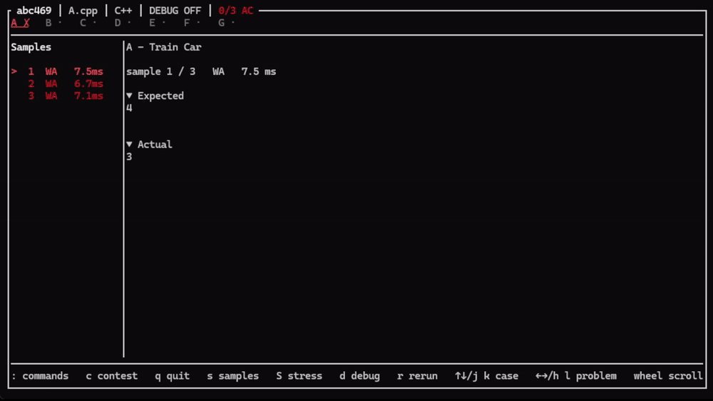

# atc

Fast AtCoder workflow from your terminal.

AtCoder のコンテスト環境の作成、サンプルテスト、ファイル監視、ストレステストなどを、
ターミナルからまとめて扱うための CLI ツールです。



## インストール

### Windows

[Scoop](https://scoop.sh/) を使ってインストールできます。

```powershell
scoop bucket add atc https://github.com/toppoun/scoop-atc
scoop install atc/atc
```

### macOS（Apple Silicon）

[Homebrew](https://brew.sh/) を使ってインストールできます。

```bash
brew install toppoun/atc/atc
```

現在、以下の環境向けにバイナリを配布しています。

- Windows x86_64
- macOS Apple Silicon

インストール後は、次のコマンドで環境を確認できます。

```bash
atc doctor
```

## クイックスタート

AtCoder のコンテストを保存するディレクトリを作り、ワークスペースを初期化します。

```bash
mkdir atcoder
cd atcoder
atc init
```

参加するコンテストを開きます。

```bash
atc contest abc466
```

コンテストがまだ存在しない場合は、問題情報とサンプルを取得して自動で作成します。

そのまま TUI が起動し、ソースコードを保存するたびにサンプルテストが実行されます。

終了するには `q` を押します。

## 主な機能

- コンテスト環境の作成と切り替え
- 問題情報とサンプルケースの取得
- C++ / Python のソースファイル作成
- サンプルテストの実行
- ファイル保存時の自動テスト
- テスト結果を確認できる TUI
- TUI からのソースコード・設定・テンプレート編集
- ストレステストと失敗ケースの保存
- ソーステンプレートと実行環境のカスタマイズ

## TUI

`atc watch` または `atc contest` から TUI を利用できます。

```bash
atc watch
```

主な操作:

| キー | 操作 |
| --- | --- |
| `h` / `←` | 前の問題 |
| `l` / `→` | 次の問題 |
| `j` / `↓` | 次のテストケース |
| `k` / `↑` | 前のテストケース |
| `r` | テストを再実行 |
| `d` | C++ Debug の切り替え |
| `s` | Samples ペインの表示切り替え |
| `S` | Stress Test |
| `i` | Stress Helper の作成 |
| `c` | Contest の切り替え |
| `:` | Command Palette |
| `q` | 終了 |

Command Palette からは、ソースコードや設定ファイルの編集、コンテストの更新・切り替えなども行えます。

詳しくは [TUI](docs/tui.md) を参照してください。

## コマンド

| コマンド | 説明 |
| --- | --- |
| `atc init` | ワークスペースを初期化 |
| `atc new <contest>` | 実行ディレクトリ直下にコンテストを作成 |
| `atc contest <contest>` | workspace の振り分けでコンテストを開く・作成・切り替え |
| `atc refresh` | 問題情報とサンプルを更新 |
| `atc test <problem>` | サンプルテストを実行 |
| `atc watch` | ソースを監視して自動テスト |
| `atc stress <problem>` | ストレステストを実行 |
| `atc stress init <problem>` | Stress Helper を作成 |
| `atc create <name>` | ソースファイルを作成 |
| `atc template init` | ユーザーテンプレートを作成 |
| `atc config init` | 設定ファイルを作成 |
| `atc login` | AtCoder の認証状態を確認 |
| `atc doctor` | ローカル環境を診断 |

各コマンドの詳しいオプションは `--help` で確認できます。

```bash
atc --help
atc test --help
atc stress --help
```

## 設定

`atc` は設定ファイルなしでも使用できます。

設定を変更したい場合は、次のコマンドで設定ファイルを作成します。

```bash
atc config init
```

デフォルト言語、C++ コンパイラ、Python、タイムアウト、エディタなどを変更できます。

詳しくは [設定](docs/configuration.md) を参照してください。

## テンプレート

C++ / Python のソーステンプレートを自分用に変更できます。

```bash
atc template init cpp
```

作成されたテンプレートを編集すると、それ以降に作成するソースファイルへ反映されます。

詳しくは [テンプレート](docs/templates.md) を参照してください。

## 動作環境

C++ を使用する場合は、C++23 に対応したコンパイラが必要です。
デフォルトでは `g++` を使用します。

Python を使用する場合は `python` コマンドが必要です。
ストレステストの Generator / Brute Force にも Python を使用します。

環境に問題がある場合は、まず次を実行してください。

```bash
atc doctor
```

## ドキュメント

- [設定](docs/configuration.md)
- [ワークスペース](docs/workspace.md)
- [テストと Watch](docs/testing.md)
- [TUI](docs/tui.md)
- [ストレステスト](docs/stress.md)
- [テンプレート](docs/templates.md)
- [AtCoder 認証](docs/authentication.md)
- [トラブルシューティング](docs/troubleshooting.md)

## License

[MIT License](LICENSE)
